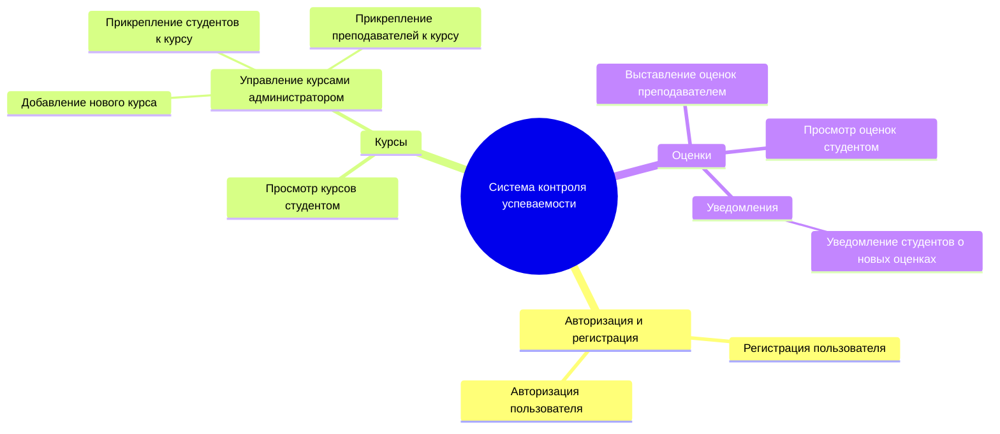
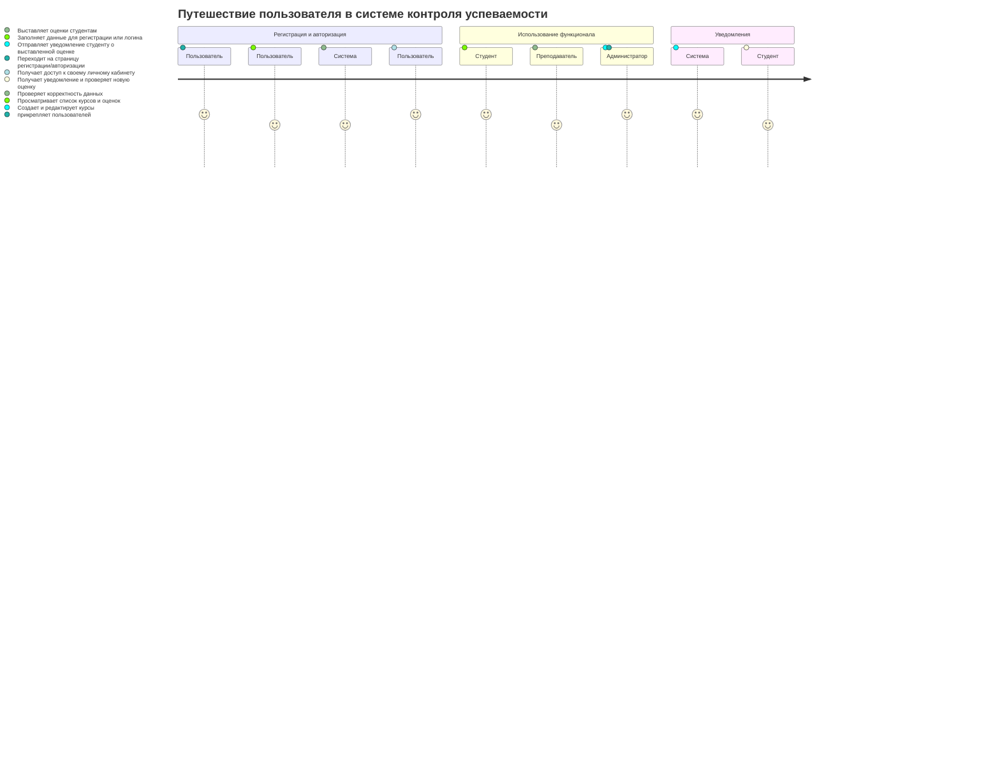
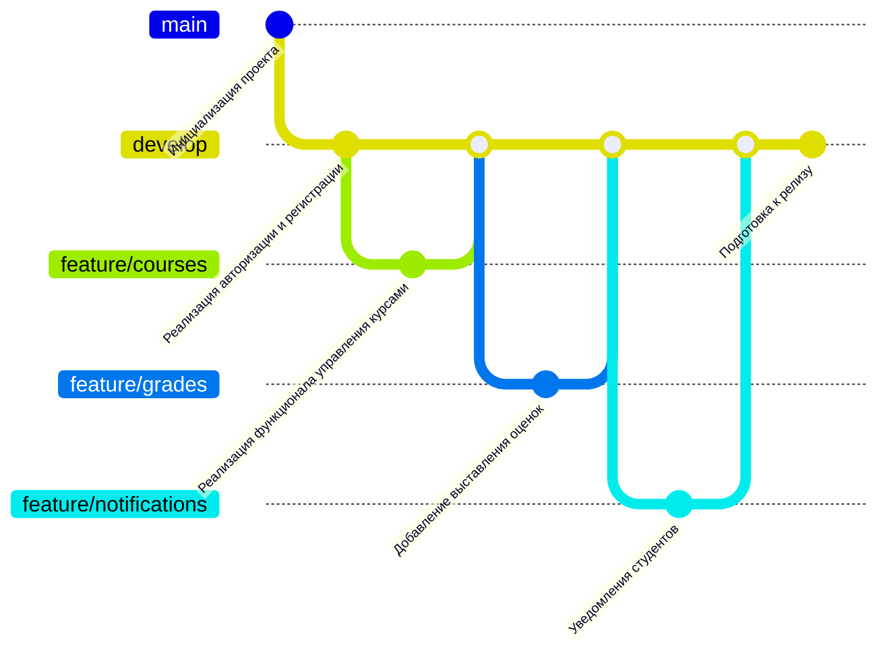

# Система Контроля Успеваемости Обучающихся

Данная система предназначена для автоматизации процессов управления учебными курсами, выставления оценок и отслеживания успеваемости студентов. В системе реализованы три ключевые роли: студент, преподаватель и администратор.

---

## Структура функциональных возможностей (Mind Map)



## Описание диаграммы
 ### Корень: Основной функционал системы контроля успеваемости.
 ### Авторизация и регистрация: Позволяет пользователям зарегистрироваться в системе и авторизоваться.
 ### Курсы: Управление курсами включает просмотр курсов студентами и их настройку администратором (добавление новых курсов, прикрепление участников).
 ### Оценки: Преподаватели выставляют оценки, а студенты их просматривают. Система отправляет уведомления студентам о новых оценках.
 
 ---

## Диаграмма путешествия пользователя (User Journey Diagram)


## Описание диаграммы
### Регистрация и авторизация: Пользователь регистрируется или входит в систему через форму авторизации.
### Использование функционала:
  Студент может просматривать свои курсы и оценки.
  Преподаватель выставляет оценки студентам.
  Администратор управляет курсами, добавляя новые или редактируя существующие.
### Уведомления: Студент получает уведомления от системы о выставленных оценках.
---

## Квадрант-граф (Priority Matrix)
```mermaid
quadrantChart
title Приоритеты разработки функционала системы
x-axis Ожидаемая ценность
y-axis Сложность реализации
quadrant-1 [Высокая ценность, Высокая сложность]
    "Уведомления студентов"
    "Управление курсами администратором"
quadrant-2 [Высокая ценность, Низкая сложность]
    "Просмотр оценок студентом"
    "Выставление оценок преподавателем"
quadrant-3 [Низкая ценность, Низкая сложность]
    "Авторизация и регистрация"
quadrant-4 [Низкая ценность, Высокая сложность]
    "Расширенные аналитические отчеты"
```
## Описание диаграммы
Квадрант 1 (Высокая ценность, Высокая сложность):
Уведомления для студентов о новых оценках.
Полное управление курсами со стороны администратора.
Квадрант 2 (Высокая ценность, Низкая сложность):
Просмотр оценок студентом.
Выставление оценок преподавателем.
Квадрант 3 (Низкая ценность, Низкая сложность):
Основной функционал регистрации и авторизации пользователей.
Квадрант 4 (Низкая ценность, Высокая сложность):
Расширенные аналитические отчеты для пользователей системы.
---

## Git Graph


Описание графа
Инициализация проекта: Создание базовой структуры проекта.
Разработка: Ветка develop служит для объединения всех фич.
Реализация функционала:
feature/courses: Добавление и управление курсами.
feature/grades: Возможность выставлять оценки.
feature/notifications: Уведомления для студентов.
Слияние и релиз: Все фичи объединены в ветку develop, после чего проект готовится к релизу.


