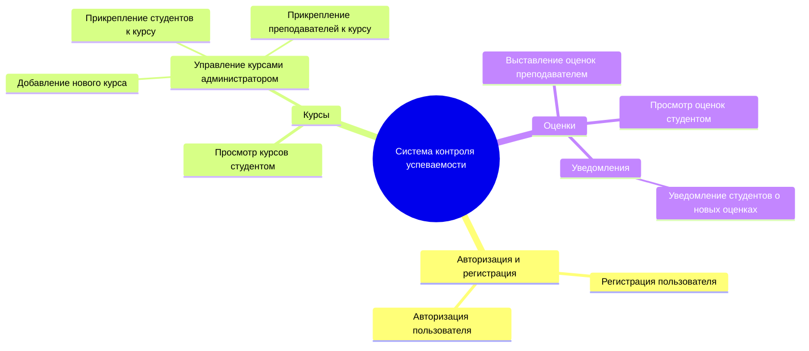

# mermaid-practice

# Система Контроля Успеваемости Обучающихся

Данная система предназначена для автоматизации процессов управления учебными курсами, выставления оценок и отслеживания успеваемости студентов. В системе реализованы три ключевые роли: студент, преподаватель и администратор.

---

## Структура функциональных возможностей (Mind Map)

## Описание диаграммы
### Корень: Основной функционал системы контроля успеваемости.
 ### Авторизация и регистрация: Позволяет пользователям зарегистрироваться в системе и авторизоваться.
 ### Курсы: Управление курсами включает просмотр курсов студентами и их настройку администратором (добавление новых курсов, прикрепление участников).
 ### Оценки: Преподаватели выставляют оценки, а студенты их просматривают. Система отправляет уведомления студентам о новых оценках.
