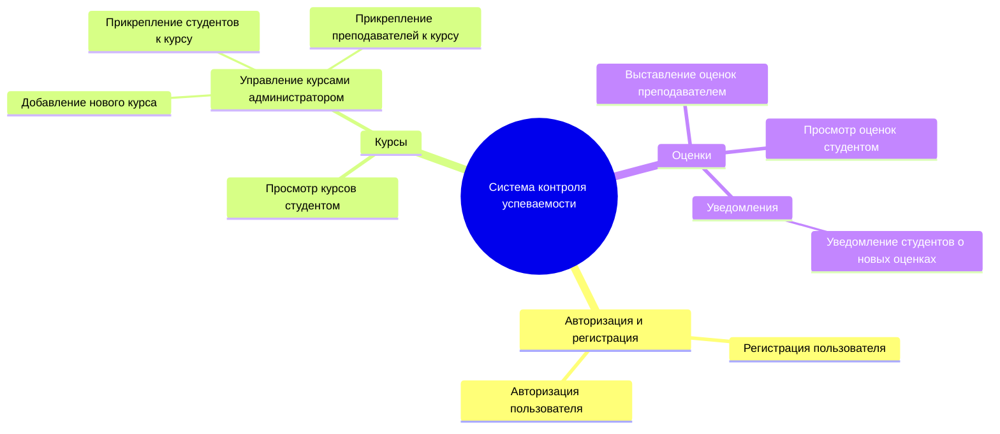
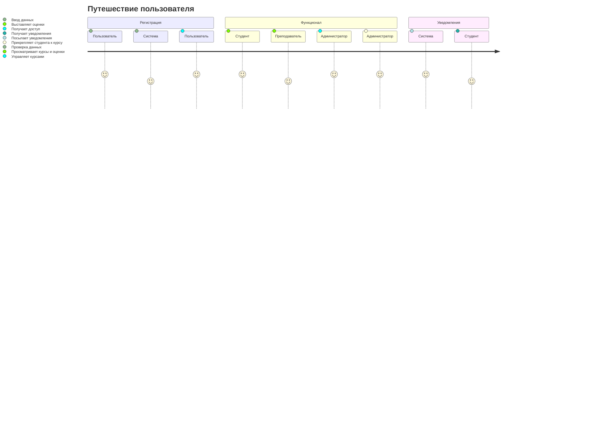
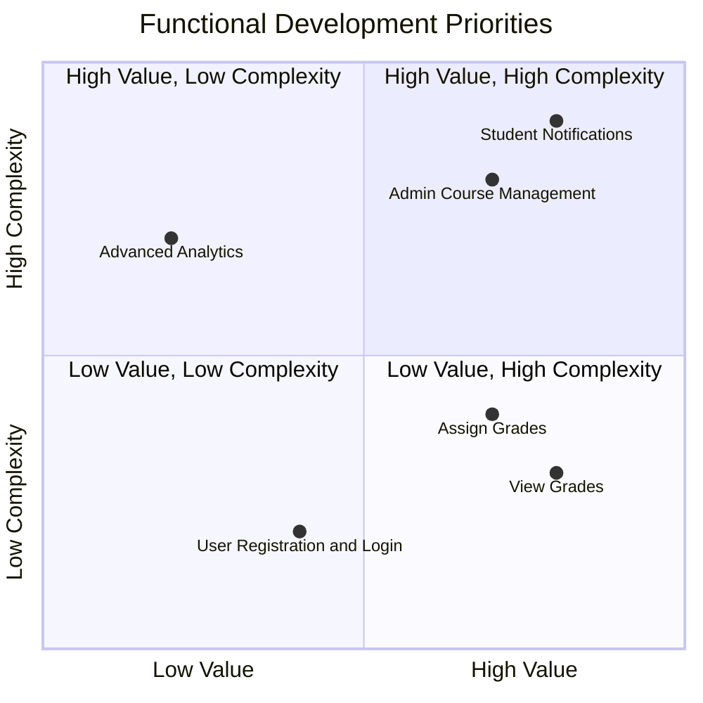
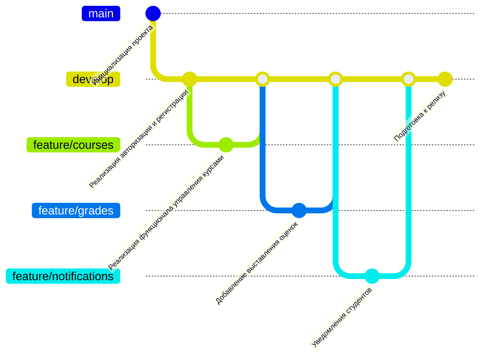

# Система Контроля Успеваемости Обучающихся

Данная система предназначена для автоматизации процессов управления учебными курсами, выставления оценок и отслеживания успеваемости студентов. В системе реализованы три ключевые роли: студент, преподаватель и администратор.

---

## Структура функциональных возможностей (Mind Map)

### Описание диаграммы
- **Корень:** Основной функционал системы контроля успеваемости.
- **Авторизация и регистрация:** Позволяет пользователям зарегистрироваться в системе и авторизоваться.
- **Курсы:** Управление курсами включает:
  - Просмотр курсов студентами.
  - Добавление новых курсов, прикрепление студентов и преподавателей администратором.
- **Оценки:** Преподаватели выставляют оценки, а студенты их просматривают. Система отправляет уведомления студентам о новых оценках.

---
 
 ---

## Диаграмма путешествия пользователя (User Journey Diagram)

### Описание диаграммы
1. **Регистрация и авторизация:** Пользователь регистрируется или входит в систему через форму авторизации.
2. **Использование функционала:**
   - Студент может просматривать свои курсы и оценки.
   - Преподаватель выставляет оценки студентам.
   - Администратор управляет курсами, добавляя новые или редактируя существующие.
3. **Уведомления:** Студент получает уведомления от системы о выставленных оценках.

---

## (Priority Matrix)

### Описание диаграммы
- **Квадрант 1 (Высокая ценность, Высокая сложность):**  
  Задачи, которые приносят значительную пользу системе, но требуют сложных технических решений.  
  - Уведомления студентов о новых оценках.  
  - Управление курсами администратором.  

- **Квадрант 2 (Высокая ценность, Низкая сложность):**  
  Простые задачи с высокой ценностью для пользователей.  
  - Просмотр оценок студентом.  
  - Выставление оценок преподавателем.  

- **Квадрант 3 (Низкая ценность, Низкая сложность):**  
  Базовый функционал, который легко реализовать, но он не оказывает значительного влияния на систему.  
  - Авторизация и регистрация.  

- **Квадрант 4 (Низкая ценность, Высокая сложность):**  
  Функции, которые сложно реализовать, но имеют низкую приоритетность.  
  - Расширенные аналитические отчеты.

---
## Git Graph

### Описание графа
- **Инициализация проекта:** Создание базовой структуры проекта.
- **Разработка:** Ветка `develop` служит для объединения всех фич.
- **Реализация функционала:**
  - `feature/courses`: Добавление и управление курсами.
  - `feature/grades`: Возможность выставлять оценки.
  - `feature/notifications`: Уведомления для студентов.
- **Слияние и релиз:** Все фичи объединены в ветку `develop`, после чего проект готовится к релизу.

